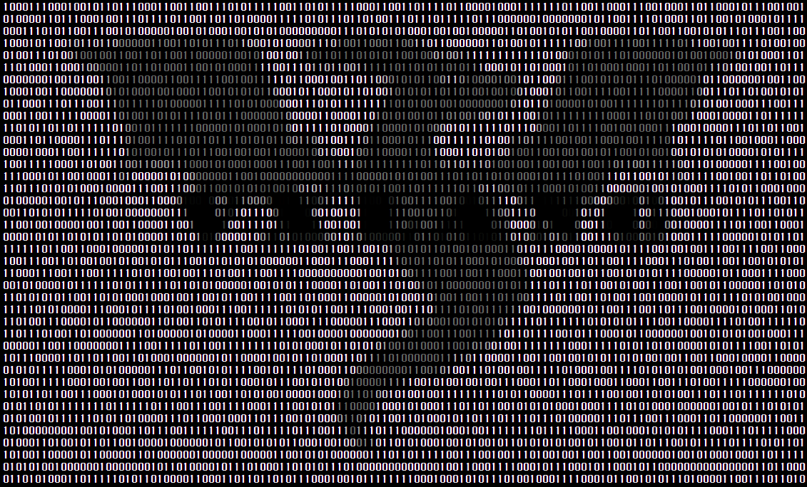
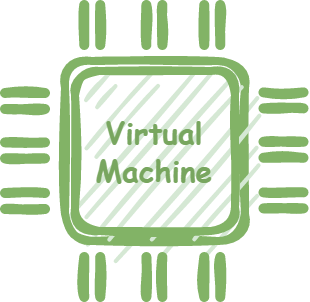

# {{ page.title }}

   

 
  
## Overview

**vxlang** is an anti-tamper project to prevent static or dynamic analysis, file modification, and tampering from attackers. Software that is dependent on the system is compiled and converted into machine language code. This is represented by a human-visible mnemonic.   

The mnemonic can be found through the disassembler that fits the system, and additional information can be collected and restored to higher-level code.   This software analysis and modulation process is a reverse engineering activity, and the vxlang project supports services that prevent it.   
   
vxlang currently targets native binary files on x86-64 and Microsoft Windows systems(*.exe/*.dll). The target binary type will be expanded through the update.   

## Software Protector

   

Executable compression is a method of compressing files in an executable state. This compression state hides the source code and file information. In this state, the software protector blocks additional encryption and access in runtime state. vxlang acts as a software protector, providing file modulation, code modulation, and dynamic analysis protection.   

## Software Code obfuscation and virtualization

   

The software protector blocks access to the encryption and runtime states, but has the weakness of exposing the source when the runtime state is dumped. Adding dummy code to the source code exposed in this static or dynamic state or modulating it with the same code is described as code obfuscation.

Code virtualization is a way of representing real-world operational commands as virtual code and allowing them to operate on internal virtual machines. vxlang supports these obfuscation and virtualization services.

## Latest Version

0.8.9 
---
- SDK release. 
- Added extension module functionality. 
- Add virtualization commands. 
- Bug fix 
- Features will be added through hotfix updates (ex. Packer control via expansion module) 
  - **Hotfix.2023.01.23**
    - Fix virtualization algorithms for entry points
	- Disable Forced Packing
	- Fix Known Bugs
  - [Download](https://url.kr/xjvo2s) 

## Step

The first step is to ensure that all features supported by vxlang work reliably and support additional features.

## Special Thanks

Thank you to everyone who helped with the development.

- [2GG](https://twitter.com/2gg) 
- [kao](https://lifeinhex.com/) 
  - [Crackme01](https://forum.tuts4you.com/topic/43809-users-desktop-crackme/#comment-213340) 
- [Extreme Coders](https://github.com/extremecoders-re/tuts4you_users_desktop_crackme_writeup) 
  - [Crackme01](https://forum.tuts4you.com/topic/43809-users-desktop-crackme/#comment-213328)  
- [clavis0x](https://github.com/clavis0x)
- [tybins99](https://github.com/tybins99)  
  
